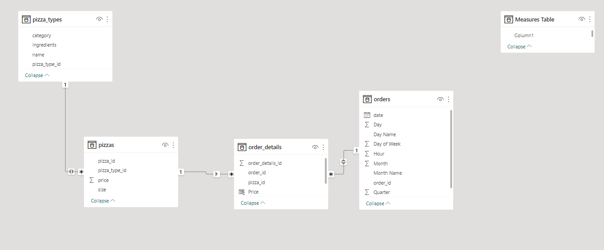

# Pizza Sales AnalysiS

## Introduction
This is a Power BI project on the sales analysis of a pizza store on **Maven Analytics**.
The project is to analyze and derive insight to answer the crucial question and help the pizza store make data driven decisions.

## Problem Statement
1. Total order per Day, Month, and Quarter
2. Total Revenue per Day, Month, and Quarter
3. Peak Period of Sales
4. Highest-selling pizza
5. Least-selling pizza

## Skill/ Concepts Demonstrated:

 The following Power BI features were incorporated:
 1. Bookmarking
 2.  DAX
 3.  Quick measures
 4.  Modelling
 5.  Filters

## Modelling
Automatically derived relationships are adjusted to remove and replace unwanted relationships with the required ones.

## Visualization
The report is one page with 2 categories
- Order 
- Revenue
You can interact with the report [here](https://app.powerbi.com/groups/me/reports/730b005d-2e38-4c99-b919-94ab4c148649/ReportSectionbd826edcd00305bd7ae2?experience=power-bi)

## Analysis
### Order History:
The store has a total of 21k orders.
1.78k orders were made per month
5.34k orders were made per quarter, and
59.64 were made per day

### Product catalog:
There are 32 types of pizza, with 4 categories and 5 sizes.
### Revenue:
The store made a total revenue of $817.86k 
$204.47k revenue per quarter
$68.16k per month and 
$2.28k per day

## Conclusion and Recommendations:
- The fourth quarter recorded the lowest order. this can be attributed to end of summer, as people are more likely to stay inside during winter
- All the months in the 4th quarter except November peaked past the average order per month. this may be due to Black Friday and Thanksgiving
- The end of the week (Thursday–Saturday) saw higher orders in comparison to other daysof the week
- The revenue trend is similar to the order trend except quarter 3, which recorded lower revenue as compared to quarter 2
- Peak periods for orders during the weekdays were between 12-1 pm and 5-6 p.m., which coincided with lunch breaks and the end of work. the peak period fell between 5-8 pm during the weekend 
- The Class Deluxe was the most ordered pizza. Despite this, it only manages ($38.2k) in revenue behind Thai Chicken ($43.4k), Barbecue Chicken ($42.8k), and Califonia Chicken ($41.4k).
- The Brie Currie Pizza was 480 times less than the average (680). it averages $23.65 revenue across all sizes, making it the most expensive type

# Recommendation:

For a deep dive into the analytics, the folling 
- XL and XXL should be scrapped because they contribute less to the order and revenue
